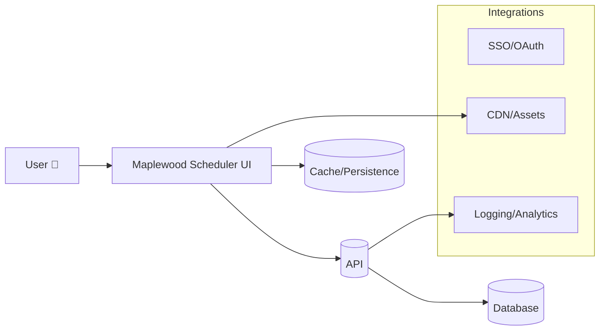

<!-- README_HEADER -->
<div align="center">
  <h1>🚀 Maplewood Scheduler</h1>
  <p><em>Smart scheduling for modern teams</em></p>
  
  <p>
    <a href="https://github.com/koonergurjot/maplewood-scheduler/actions/workflows/ci.yml"></a>
    <a href="./LICENSE"></a>
    <a href="https://github.com/koonergurjot/maplewood-scheduler/stargazers"></a>
    <a href="https://github.com/koonergurjot/maplewood-scheduler/issues"></a>
    <a href="https://github.com/koonergurjot/maplewood-scheduler/pulls"></a>
    <a href="https://github.com/koonergurjot/maplewood-scheduler/commits"></a>
    
  </p>
</div>

> Maplewood Scheduler keeps teams on track with a friendly UI and robust API. Plan shifts, track coverage, and ship with confidence.

<p align="center">
  
  
  
  
</p>

<p align="center">
  <a href="TODO">Live Demo</a> •
  <a href="#installation--quick-start">Quickstart</a> •
  <a href="https://github.com/codespaces/new">Open in Codespaces</a>
</p>

<details>
<summary>Table of Contents</summary>

- [Screenshots](#screenshots)
- [Live Demo & Quick Links](#live-demo--quick-links)
- [Features](#features)
- [Architecture](#architecture)
- [Tech Stack](#tech-stack)
- [Installation & Quick Start](#installation--quick-start)
- [Configuration](#configuration)
- [Usage](#usage)
- [Why this project?](#why-this-project)
- [Performance & Accessibility](#performance--accessibility)
- [Security](#security)
- [Roadmap](#roadmap)
- [Contributing](#contributing)
- [Code of Conduct](#code-of-conduct)
- [FAQ](#faq)
- [Troubleshooting](#troubleshooting)
- [Changelog](#changelog)
- [Acknowledgements](#acknowledgements)
- [License](#license)

</details>

## Screenshots

Screenshots are stored in `./docs/media/` and are not tracked in git.
Replace the placeholders below with your own images.


|  |  |  |
|:--:|:--:|:--:|
| Calendar board | Reports view | Responsive UI |

## Live Demo & Quick Links

- 🌐 [Live Demo](TODO)
- 📚 [Docs](./docs/OVERVIEW.md)
- 🐞 [Issues](https://github.com/koonergurjot/maplewood-scheduler/issues)
- 💬 [Discussions](https://github.com/koonergurjot/maplewood-scheduler/discussions)
- 🛣️ [Roadmap](#roadmap)

## Features

- 🚀 **Real-time updates** – see changes instantly.
- 🎯 **Smart recommendations** – suggest optimal schedules.
- 🔄 **Bulk actions** – manage multiple shifts quickly.
- 🔒 **Secure by design** – token-based auth.
- 📱 **Responsive** – works on any device.

## Architecture



## Tech Stack

- ⚛️ React
- 🌀 Vite
- 🟦 TypeScript
- 🗄️ Express
- 🧪 Vitest

## Installation & Quick Start

```bash
git clone https://github.com/koonergurjot/maplewood-scheduler.git
cd <repo>
npm install
npm run dev
```

> **Note:** The UI fetches analytics data from the Express backend during local development. In another terminal, run `node server/index.js` (or your preferred proxy to the analytics API) so `/api` requests resolve to a server such as `http://localhost:3001` while the Vite dev server is running.

## Configuration

| Variable | Default | Description |
|---------|---------|-------------|
| `ANALYTICS_AUTH_TOKEN` | – | Bearer token for analytics endpoints |
| `PORT` | `3001` | Analytics server port (binds to all network interfaces) |

Example `.env.local`:

```bash
ANALYTICS_AUTH_TOKEN=mys3cret
PORT=3001
```

## Usage

```ts
import { getVacancies } from "./src/utils/api";

getVacancies().then(console.log);
```

## Why this project?

1. 🎯 Focused on scheduling pains of small teams.
2. 🌈 Friendly, accessible interface.
3. 🧩 Flexible architecture for integrations.

## Performance & Accessibility

- ✅ Lazy-loaded routes and code-splitting.
- ✅ Tested with keyboard and screen readers.
- ✅ Color-contrast checked against WCAG AA.

## Security

Please report vulnerabilities via [responsible disclosure](./SECURITY.md).

## Roadmap

- [ ] Public API
- [ ] Mobile PWA
- [ ] Plugin marketplace

## Contributing

We welcome contributions! See [CONTRIBUTING.md](./CONTRIBUTING.md) for guidelines.

## Code of Conduct

Please read the [Code of Conduct](./CODE_OF_CONDUCT.md) before contributing.

## FAQ

**How do I reset the database?**
: Remove `storage` data and restart the server.

**Can I deploy on Windows?**
: Yes, via Docker or Node 18+.

**Is there a dark mode?**
: Yes, toggle via the 🌓 icon in the header.

**Does it support mobile?**
: Fully responsive with touch support.

**Where can I get help?**
: Open a [discussion](https://github.com/koonergurjot/maplewood-scheduler/discussions).

## Troubleshooting

| Problem | Fix |
|---------|-----|
| `npm install` fails | Use Node 18+ and run `npm cache clean --force`. |
| Port already in use | Set `PORT` in `.env.local`. |

## Changelog

See [CHANGELOG.md](./CHANGELOG.md).

## 🚧 Fixes for “repo not found” in badges/links

If GitHub shows **"repo not found"** on badges or links, it’s usually caused by placeholder URLs left in the README.

**Already fixed here:** All `https://github.com/&lt;org&gt;/&lt;repo&gt;` placeholders were replaced with `koonergurjot/maplewood-scheduler`.

**Double‑check:**  
- The repository is public: https://github.com/koonergurjot/maplewood-scheduler  
- Badges use the exact repo path (`koonergurjot/maplewood-scheduler`) and a real workflow file name if you enable CI.  
- If you rename the repo later, update this README or set up repository redirects.

**Optional: add CI badge**  
Once you add a workflow at `.github/workflows/ci.yml`, uncomment/update the CI badge line so it points to:
```
https://github.com/koonergurjot/maplewood-scheduler/actions/workflows/ci.yml/badge.svg
```

## Acknowledgements

Built with <span style="color:#0ea5e9">community support</span> and lots of ☕.

## License

Released under the [MIT](./LICENSE) License.

---

<p align="center">
If this project helps you, ⭐ the repo or <a href="https://github.com/sponsors/koonergurjot">become a sponsor</a>.
</p>


## 🛠️ Build Notes & Common Errors

- **papaparse not resolved**: This project externalizes `papaparse` in `vite.config.ts`. Ensure it’s installed:
  ```bash
  npm i papaparse
  ```
  and keep this in `vite.config.ts`:
  ```ts
  rollupOptions: { external: ["papaparse"] }
  ```

- **TypeScript types missing**: If CI complains about Node types, install:
  ```bash
  npm i -D @types/node
  ```

- **JSX “one parent element” errors**: Make sure JSX returns a single parent element. Wrap sibling elements in a fragment:
  ```tsx
  return (
    <>
      <Header />
      <Content />
    </>
  )
  ```

- **Netlify deploy**: In Netlify settings, set **Build command** to `npm run build` and **Publish directory** to `dist`. If you use environment variables, prefix them with `VITE_` (e.g., `VITE_API_URL`) so Vite exposes them to the client.
