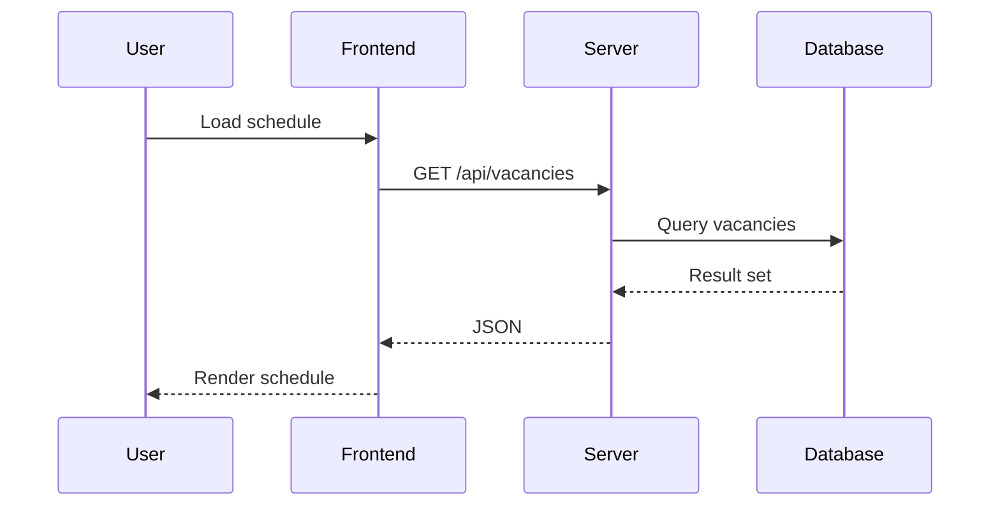

# Overview

Maplewood Scheduler is a web app for planning and tracking work schedules.
This document dives deeper into how the pieces fit together.

## Architecture

The app is split between a React/Vite front end and an Express server.
State persists to local storage and the server's data store.

## Sequence

## Open Vacancies filters

The redesigned Open Vacancies list restores the full set of toolbar filters. Admins can now
combine keyword search, wing, classification, shift preset, countdown status, bundle mode,
and date range chips to quickly zero in on the vacancies they need to manage.
